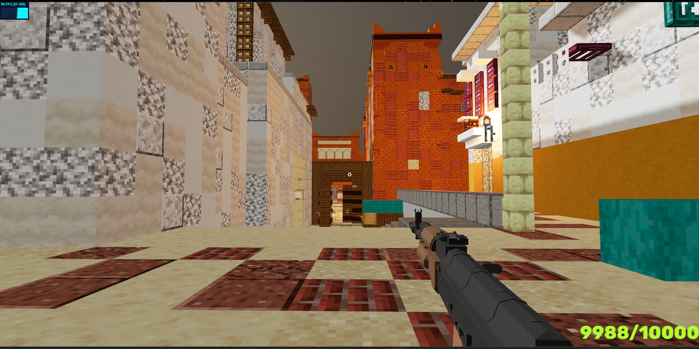

# Minecraft - FPS

## This game is built to learn Three JS basics implementing in FPS game 

## Using ReactJS with R3F and Three.js with RAPIER Physics engine
## Use it as you need if possible give a start to the repo

### 1. Rendering Map and Player with gun models
* Rendering Dust 2 Map
* Rendering Gun with Player as capsule collider

### 2. Character Controller
* Move Forward, Backward, Sideways, Jump, Crouch

### 3. Lights and Sun with shadows
* Rendering Lights for the lamps 
* Rendering Sun with normalBias and offest

### 4. Raycasting for bullet shooting
* Raycasting using THREE JS
* Raycasting using RAPIER Physics

### 5. Collision detection for characters (hitboxes)
* Hitboxes for characters parts
* Bullets collision detection for hitboxes

### To start the game clone the repo and run below command

`npm run dev
`

